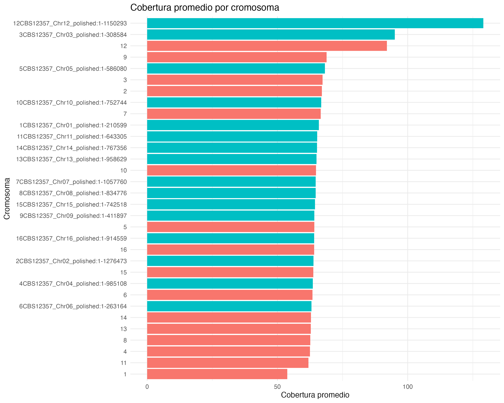
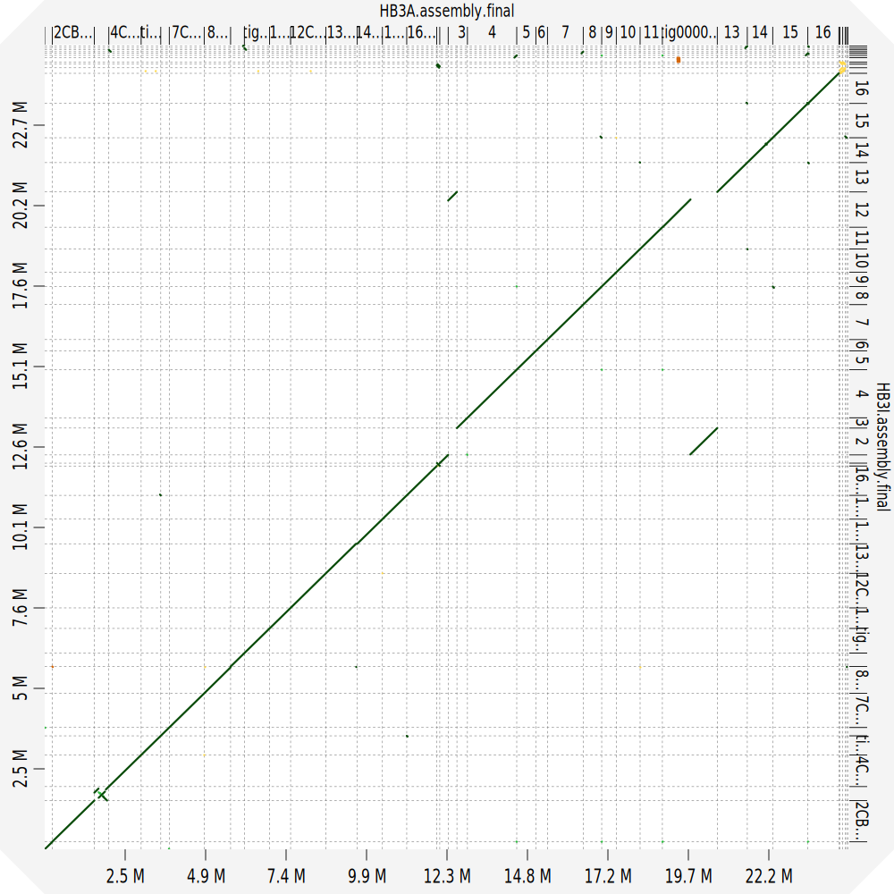
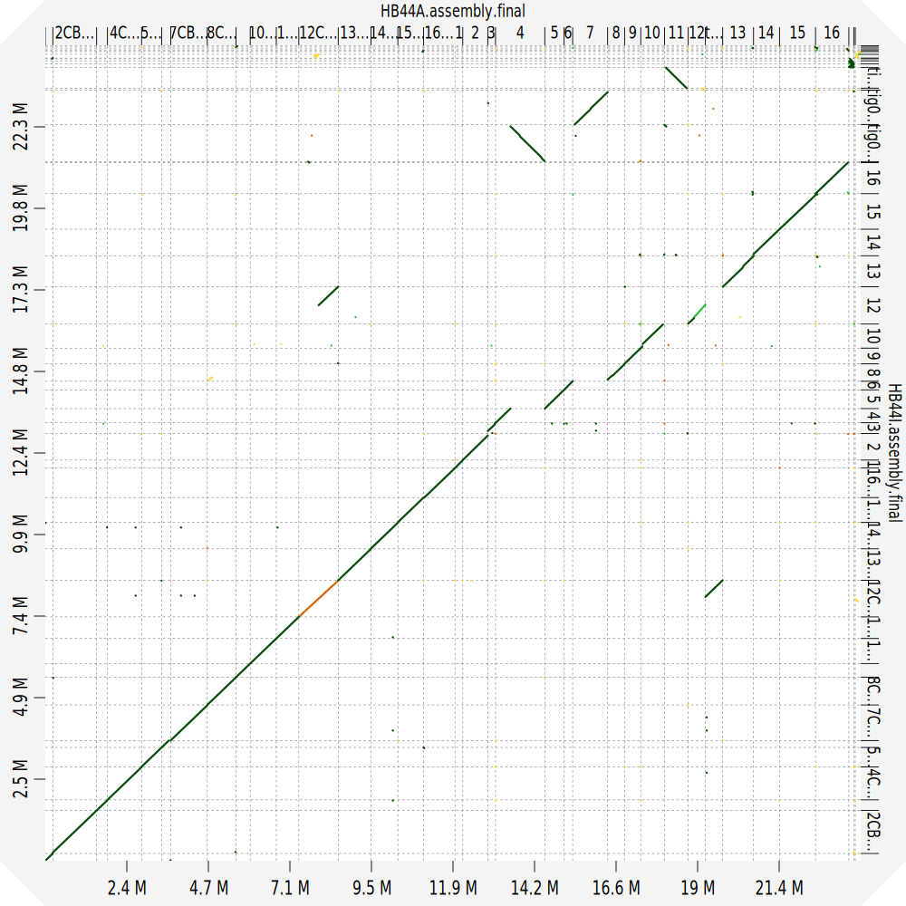

# Metodología de análisis bioinformático de híbridos poliploides evolucionados
#### Tomas Peña E.

## Contexto
Híbridos poliploides Inter-especie *Saccharomyces cerevisiae* x *Saccharomyces eubayanus* con potencial industrial para la elaboración de cerveza *Lager* fueron sometidos a un proceso de evolución experimental para mejorar su capacidad fermentativa. Luego de X número de generaciones, los híbridos con mejoras en el fenotipo de fermentación, entendido como la capacidad de metabolizar los azucares presentes en el mosto a partir del metabolismo de fermentación alcohólica, fueron secuenciados con tecnología illumina (*short reads*). Especificamente, los híbridos ancestrales H3 y H44 junto a tres líneas de evolución fueron seleccionadas. Adicionalmente, ambos híbridos ancestrales y la línea evolucionada con mayor capacidad fermentativa de cada parental fueron secuenciadas con tecnología Nanopore (*long reads*) para un análisis de genoma comparativo. Empleando la información genética por illumina se confirmaron (1) los parentales de cada híbrido, (2) la ploidía, y (3) las diferencias genéticas entre los híibridos evoluciónados y los ancestrales. Ademas, con las secuencias obtenidas por Nanopore se obtuvieron genomas ensamblados de novo, con los cuales se (4) detectaron variantes estructurales entre parentales, híbridos ancestrales y evoluciónados.

## Identificacion de parentales
Por motivos que no recuerdo existian dudas sobre los parentales de los híbridos H3 y H44.  
Los parentales originales eran:  

|Parental       | H3                 | H44                  |
|---------------|--------------------|----------------------|
|*S. eubayanus* |CL715 (SAMN11565760)|CL620 (SAMN11565793)  |
|*S. cerevisiae*|NCYC_88 (ERR1309233)|SM.8.7.L8 (ERR1308656)|

Vasni me entregó un set de posibles parentales:  

|ID SRR               |Spp              |
|---------------------|-----------------|
|CL450	SAMN11565754  |*S. eubayanus*   |
|CL715	SAMN11565760  |*S. eubayanus*   |
|CL248	SAMN11565774  |*S. eubayanus*   |
|CL620	SAMN11565793  |*S. eubayanus*   |
|CL216	SAMN11565818  |*S. eubayanus*   |
|CL609	SAMN11565756  |*S. eubayanus*   |
|YJM271	SRR800770     |*S. cereivisae*  |
|DBVPG6876 ERR1308943 |*S. cereivisae*  |
|RIB1001	ERR1309055|*S. cereivisae*  |
|M9.1	ERR1308583    |*S. cereivisae*  |

En terminos generales, la metodologia consistio en obtener los datos crudos de cada parental potencial y los híbridos, y mapearlos contra un genoma de referencia concatenado de S288c y CBS12357. Se determinaron los parentales de cada hpibrido en base al numero de SNPs compartidos.

##**Identificacion parentales**

### Obtención de datos crudos
(1) Descargar raw reads desde NCBI con la herramienta sratools (https://github.com/ncbi/sra-tools)  
**Chequear la instalación**

```
export PATH=$PATH:$PWD/sratoolkit.3.0.7-mac64/bin
which fastq-dump
```

**Pre descargar la metadata de las reads**  

```
for srr in $(cat SRAParentales.txt) #Archivo de texto tabulado con el nombre sra de cada parental
do
prefetch ${srr} -O
done
```  

**Descargar reads**  

```
for srr in $(cat SRAParentales.txt)
do
fasterq-dump ${srr} 
done    
```  

(2) LLamado variantes contra concatenado de referencias con metodologia mpileup  
**Mapeo con bwa**  

```
for cepa in $(cat strains.txt)
do
bwa mem ./00.RefGenome/S288C_CBS12357.HybConcat.fa ./01.TrimmedReads/${cepa}.R1.fastq.gz ./01.TrimmedReads/${cepa}.R2.fastq.gz | samtools sort -o ./02.MappedReads/${cepa}_S288C_CBS12357.HybConcat.bam
done

```  

**Añadir informacion de RG**

```
for cepa in $(cat strains.txt)
do
picard AddOrReplaceReadGroups \
I=./02.MappedReads/${cepa}_S288C_CBS12357.HybConcat.bam \
O=../02.MappedReads/${cepa}.RG_S288C_CBS12357.HybConcat.bam \
SORT_ORDER=coordinate \
RGID=DontKnow \
RGLB=01 \
RGPL=illumina \
RGSM=${cepa} \
RGPU=001 \
CREATE_INDEX=True 
done
```  

**Marcar duplicados**

```
for cepa in $(cat strains.txt)
do
picard MarkDuplicates \
I=../02.MappedReads/${cepa}.RG_S288C_CBS12357.HybConcat.bam \
O=../02.MappedReads/${cepa}.RG.MD_S288C_CBS12357.HybConcat.bam \
M=../02.MappedReads/${cepa}.RG.MD_S288C_CBS12357.HybConcat.txt
done
```  

**LLamado de variantes**  

```
for cepa in $(cat strains.txt)
do
bcftools mpileup -f ./00.RefGenome/S288C_CBS12357.HybConcat.fa ../02.MappedReads/${cepa}.RG.MD_S288C_CBS12357.HybConcat.bam -Ou -o 03.VCF/${cepa}.S288C_CBS12357.HybConcat.bcf #etapa 1
bcftools call -mv -Oz -o 03.VCF/${cepa}.S288C_CBS12357.HybConcat.vcf.gz 02.VCF/${cepa}.S288C_CBS12357.HybConcat.bcf #etapa 2
rm ${cepa}.bcf
done
```  

**Filtrar vcf**  

```
for cepa in $(cat strains.txt)
do
vcftools --gzvcf 03.VCF/${cepa}.S288C_CBS12357.HybConcat.vcf.gz \
         --minDP 70 \
         --minQ 30 \
         --remove-indels \
         --max-alleles 2 \
         --max-missing 1 \
         --recode --recode-INFO-all \
         --out 03.VCF/${cepa}.filtered.output.S288C_CBS12357.HybConcat
done
```  

**Comprimir con bgzip**  

```
bgzip -c 03.VCF/${cepa}.filtered.output.S288C_CBS12357.HybConcat.recode.vcf > H03.VCF/${cepa}.filtered.output.S288C_CBS12357.HybConcat.recode.vcf.gz
```  

**Indexar los comprimidos de bgzip***  

```
tabix -p vcf 03.VCF/${cepa}.filtered.output.S288C_CBS12357.HybConcat.recode.vcf.gz
```  

**Intersecciones**  
La idea es intersectar el vcf del híbrido con todos los potenciales parentales y extraer los snps compartidos para cada uno de ellos. El resultado son X vcf con los SNPs compartidos. Quien comparta mas SNPs es el parental.

```
for cepa in $(cat parentales.txt)
do
bcftools isec -p h3_vs_${cepa} -n =2 H44.filtered.output.S288C_CBS12357.HybConcat.recode.vcf.gz ${cepa}.filtered.output.S288C_CBS12357.HybConcat.recode.vcf.gz
done
```  

**Contar SNPs**  

```
bcftools view -H h3_vs_${cepa}/0000.vcf | wc -l
```  

**Resultados**  

|Cepa     |Spp|SNps comunes H3|
|---------|---|--------------|
|CL450    |Se |20822         |
|CL715    |Se |56620         |
|CL248    |Se |20685         |
|CL620    |Se |27008         |
|CL216    |Se |21812         |
|CL609    |Se |17355         |
|YJM271   |Sc |26623         |
|DBVPG6876|Sc |33342         |
|RIB1001  |Sc |17018         |
|M9.1     |Sc |33691         |
|SM.8.7.L8|Sc |49268         |
|NCYC_88  |Sc |27069         |

|Cepa     |Spp|SNps comunes H44|
|---------|---|----------------|
|CL450    |Se |20563           |
|CL715    |Se |21142           |
|CL248    |Se |48415           |
|CL620    |Se |21683           |
|CL216    |Se |27043           |
|CL609    |Se |23956           |
|YJM271   |Sc |32864           |
|DBVPG6876|Sc |28156           |
|RIB1001  |Sc |20439           |
|M9.1     |Sc |36699           |
|SM.8.7.L8|Sc |31513           |
|NCYC_88  |Sc |47985           |

Entonces, los parentales seran aquellas cepas con el mayor numero de SNPs compartidos con el híbrido correspondiente.  

H3: CL715 x SM.8.7.L8  

H44: CL248 x NCYC_88  

## Efecto de la evolucion en la ploidia de los hibridos en base a datos genómicos  

**Estimar ploidia ancestrales**  

Estimamos la ploidia utilizando como genoma de referencia el hibrido concatenado S288c x CBS12357. En terminos generales, primero se debe fracturar el genoma de referencia en ventanas de tamaño conocido, 1 kb en este caso. Luego, utilizando los datos del mapeo en formato BAM se estima la cobertura en cada ventana. El archivo de salida se modifica para separar los cromosmas *cerevisiae* de los *eubayanus* y se grafica en R.  


**Ventanas**  

```
bedtools makewindows -g Hyb.concat.fa.fai -w 1000 > genome_windows.bed
```  

**Cobertura por ventana**  

```
bedtools coverage -a genome_windows.bed -b ${cepa}.RG.MD_S288C_CBS12357.HybConcat.bam  > ${cepa}.coverage_output.txt
```  

**Grafico en R**  

El codigo se llama [CovAnalysis](./R_scripts/CovAnalysis.R).  

El resultado esperado es de tipo: (Se: azul | Sc: rojo)  
    

El analisis se realiza considerando que dado al presencia del rADN en el cromosoma XII, es de esperar que este posea una cobertura mucho mayor que el promedio.  
En este caso, todos lo cromosomas poseen una cobertura promedio entre 50 y 70x aproximadamente, lo cual sugiere que la relacion es **1:1**. Los casos anomalos corresponden a los cromosoma XII y al cromosoma III de *S. eubayanus*. Este ultimo si podria sugerir una aneuploidia para este cromosoma.  

Con esta metodología se determino que los hibiridos ancestrales poseen una ploidia de tipo:  
[**H3A: se:sc -> 1:1**](./Imgs/H3A_MeanCov_ploidy.png)  
[**H3IC1: se:sc -> 1:1**](./Imgs/H3IC1_MeanCov_Ploidy.png)    
[**H3IC2: se:sc -> 1:1**](./Imgs/HB31C2_MeanCov_ploidy.png)    
[**H3IC3: se:sc -> 1:1**](./Imgs/HB31C3_MeanCov_plody.png)    

[**H44A: se:sc -> 2:1**](./Imgs/H44A_MeanCov_plody.png)  
[**H44IC1: se:sc -> 2:1**](./Imgs/HB44IC1_MeanCov_ploidy.png)    
[**H44IC2: se:sc -> 2:1**](./Imgs/HB44IC2_MeanCov_plody.png)    
[**H44IC3: se:sc -> 2:1**](./Imgs/HB44IC3_MeanCov_plody.png)    

En conclusion, la evolucion experimental no afectó la plidio de los híbridos.  

## Variantes genéticas presentes en las lineas de evolucion de los hibridos poliploides  

Dado que los hibridos ancestrals H3 y H44 fueron sometidos a un proceso de evolucion experimental, colonias de tres lineas evolutivas de cada hibrido fueorn seleccionadas para secuenciacion illumina. Con estos datos se estimó el numero de de SNPs presentes unicamente en cada individuo. Para ello, se generó un genoma de referencia para cada hibrido ancestral y se llamaron variantes para cada hibrido evolucionado. Luego los vcf de cada individuo fueron intersectados para obtener solo los SNPs unicos de cada uno.  

**Genoma consenso de referencia**  

```
bcftools consensus -f Hyb.concat.fa -o H3A.consensus.fasta H3A.filtered.output.S288C_CBS12357.HybConcat.recode.vcf
```  
Este vcf debe ser procesado igual a los de la seccion de deteccion de SNPs (comprimir e indexar).  

En este nuevo genoam de referencia se llamaron SNPs igual que en la seccion anterior, con **bcftoos mpileup** y **bcftools call**.  

Luego de obtener los tres vcf de los hibridos evolucionados se realiza la interseccion con bedtools intersect: (Se debe realizar para cada linea de evolución)

```
bcftools isec -p output_dir -n=1 HB3IC1.filtered.output.recode.vcf.gz HB3IC2.filtered.output.recode.vcf.gz HB3IC3.filtered.output.recode.vcf.gz
```  

**H3IC1: 845 SNPs**  
**H3IC2: 700 SNPs**  
**H3IC3: 519 SNPs**  

**H44IC1: 1145 SNPs**  
**H44IC2: 369 SNPs**  
**H44IC3: 851 SNPs**  

Dado que muchos de estos SNPs pueden ser falsos positivos, recomiendo ajustar los filtros para que sean mas rigurosos. Ademas, de ser necesario tambien se podria inlcuir el llamado de SNPs de los parentales respecto al genoma de los hibridos ancestrales.

## Deteccion de variaciones estructurales entre hibridos evolucionados y ancestrales  

Una linea de evolucion por cada hibrido fue seleccionada para secuenciacion con Oxford Nanopore. Desconozco el criterio de seleccion, probablemente fue por fenotipo de fermentación. Luego, con los datos de secuenciacion se realizo un ensamble *de novo* de cada hibrido y su linea de evolucion con el protocolo LRSDAY sin modificaciones. Se utilizó un concatenado de S288c x CBS12357 como referencia para el orden de los cromosomas. El llamado de variantes se realizó con MUM&Co de manera estandar.  

La visualizacion de la sintenia entre los genomas se realizo en la plataforma [D-GENIES](https://dgenies.toulouse.inra.fr). El resultado puede descargarse como PNG o archivo vectorial para ajustar nombres de los cromosomas.  

Alineamiento entre H3A y H3I:  
  

Alineamiento entre H4A y H4I:  
  

El número de SVs detectadas entre **H3A** y **H3I** fueron:  

Total_SVs: **27**  
Deletions: **19**  
Insertions: **4**  
Duplications: **1**  
Contractions: **1**  
Inversions: **2**  
Translocations: **0**    

El número de SVs detectadas entre **H44A** y **H44I** fueron:  

Total_SVs: **59**  
Deletions: **26**  
Insertions: **31**  
Duplications: **2**  
Contractions: **0**  
Inversions: **0**  
Translocations: **0**  


